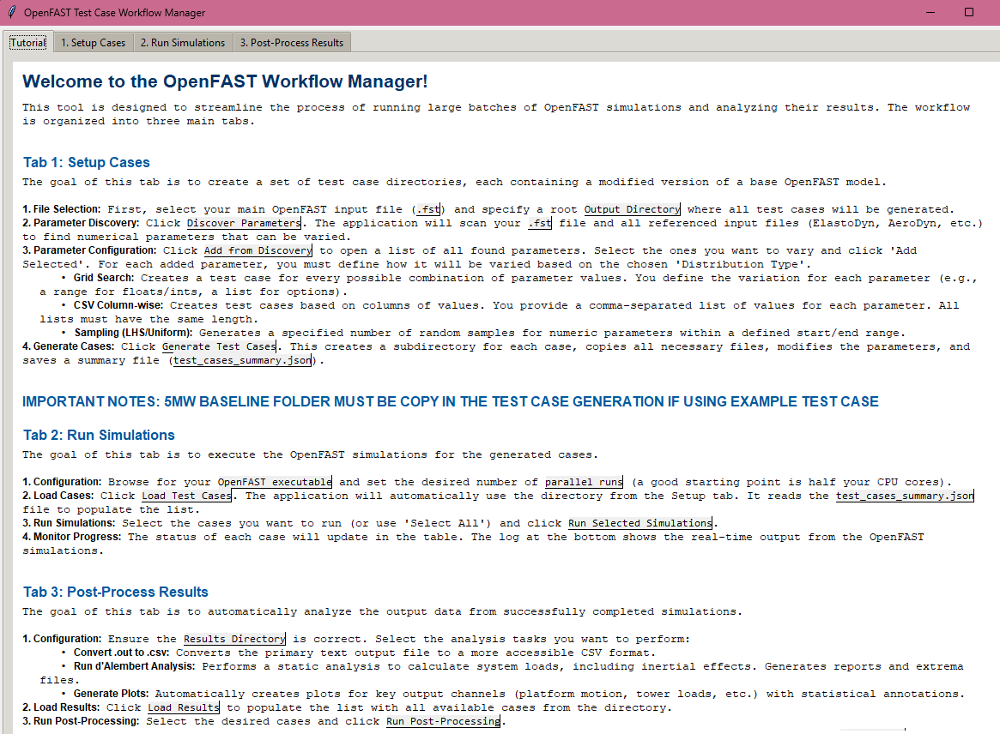

# OpenFAST Python Toolkit

[![Python Version][python-badge]][python-link]
[![License: MIT][license-badge]][license-link]
[![Pull Requests Welcome][pr-badge]][pr-link]

A user-friendly, all-in-one graphical application designed to manage the entire OpenFAST simulation workflow, from parametric case generation and parallel execution to advanced post-processing and data analysis.


*The unified interface of the OpenFAST Workflow Manager, showing the Setup, Run, and Post-Process tabs.*

---

## Table of Contents

- [Changelog](#changelog)
- [Features](#features)
- [Installation](#installation)
- [Usage](#usage)
  - [Workflow Overview](#workflow-overview)
  - [Tab 1: Setup Cases](#tab-1-setup-cases)
  - [Tab 2: Run Simulations](#tab-2-run-simulations)
  - [Tab 3: Post-Process Results](#tab-3-post-process-results)
  - [Important Notes](#important-notes)
- [Contributing](#contributing)
- [License](#license)
- [Final Notes](#final-notes)

---

## Changelog

### **v0.2 - The Workflow Manager Update**

This version marks a major architectural shift, unifying all previous scripts into a single, cohesive application and introducing a full-featured post-processing suite.

-   **🚀 Major Rearchitecture:** All separate scripts have been deprecated. Their functionality is now integrated into a single, powerful GUI application (`GUI_v0.2.py`).
-   **✨ NEW - Post-Processing Tab:** A complete, parallelized analysis workflow is now included:
    -   **Automated CSV Conversion:** Converts `.out` files to `.csv` format.
    -   **Automated Plotting:** Generates time-series plots for key output channels with statistical annotations.
    -   **d'Alembert Analysis:** A new, advanced feature to compute static equivalent loads from dynamic results, complete with automated mass/inertia calculations.
-   **✨ NEW - Tutorial Tab:** An in-app welcome screen provides a comprehensive guide for new users on the entire workflow.
-   **✨ NEW - Context Menu:** Right-click any test case in the 'Run' or 'Post-Process' tabs to open its folder directly.
-   **GUI Enhancements:**
    -   Tabs are now numbered to guide the user through the logical workflow (Setup -> Run -> Analyze).
    -   Each major stage now has its own dedicated log window for clearer feedback.

---

## Features

The toolkit is now a single, integrated application that handles the end-to-end simulation process.

✅ **Tab 1: Setup Cases**
-   **Parameter Discovery:** Automatically scans a base `.fst` file and all its linked input files to find and catalog available numerical parameters.
-   **Multiple Generation Strategies:**
    -   **Grid Search:** Generates all possible combinations of parameter variations.
    -   **CSV Column-wise:** Creates test cases where each case corresponds to a row of values provided in comma-separated lists.
    -   **Sampling:** Generates cases using Latin Hypercube, Uniform, or Normal distributions (requires `scipy`).
-   **Configuration Management:** Save and load your entire parametric study setup to a `.json` file for reproducibility.

✅ **Tab 2: Run Simulations**
-   **Parallel Execution:** Runs selected OpenFAST test cases in parallel, with a configurable number of workers to maximize CPU usage.
-   **Real-time Monitoring:** Track the status, runtime, and results of each simulation in real-time. A detailed log shows the live output from each OpenFAST instance.

✅ **Tab 3: Post-Process Results**
-   **Automated Analysis Pipeline:** Select completed cases and run a chain of analysis tasks on them in parallel.
-   **Robust CSV Conversion:** Converts standard OpenFAST text output files (`.out`) into the widely-used `.csv` format.
-   **Automatic Plot Generation:** Creates publication-ready plots for key output channels (e.g., platform motion, tower base loads, fairlead tensions) with statistical annotations (mean, min, max).
-   **Advanced d'Alembert Analysis:** Performs a static analysis by calculating inertial forces to determine static-equivalent loads, generating detailed reports and extrema files.

---

## Installation

### Prerequisites
-   Python 3.7+
-   A working installation of OpenFAST is required to run simulations.
-   The [OpenFAST r-test repository](https://github.com/OpenFAST/r-test) is a great source for example models.

### Setup Steps

1.  **Clone the repository:**
    ```bash
    git clone https://github.com/TomatoXoX/OpenFAST_GUI_Toolbox.git
    cd OpenFAST_GUI_Toolbox
    ```

2.  **Create a virtual environment (recommended):**
    ```bash
    python -m venv venv
    source venv/bin/activate  # On Windows, use `venv\Scripts\activate`
    ```

3.  **Install the required Python packages:**
    ```bash
    pip install -r numpy matplotlib pandas scipy
    ```
    The `requirements.txt` file should contain:
    ```


---

## Usage

The toolkit is now a single application. The previously separate scripts have been integrated into this GUI.

**To Launch:**
Simply execute the main GUI script from your terminal.
```bash
python GUI_v0.2.py
