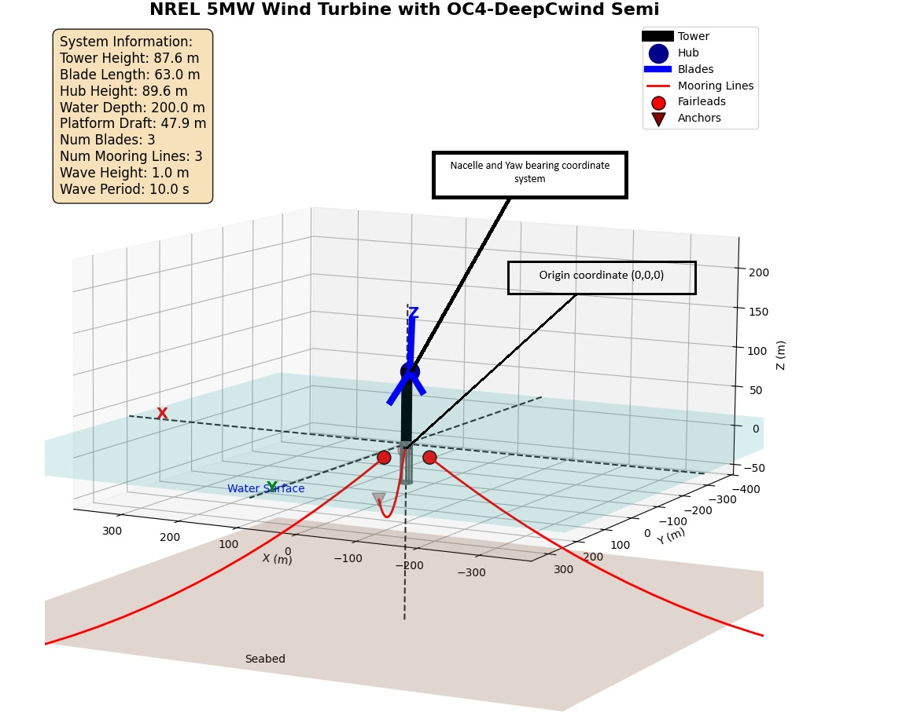
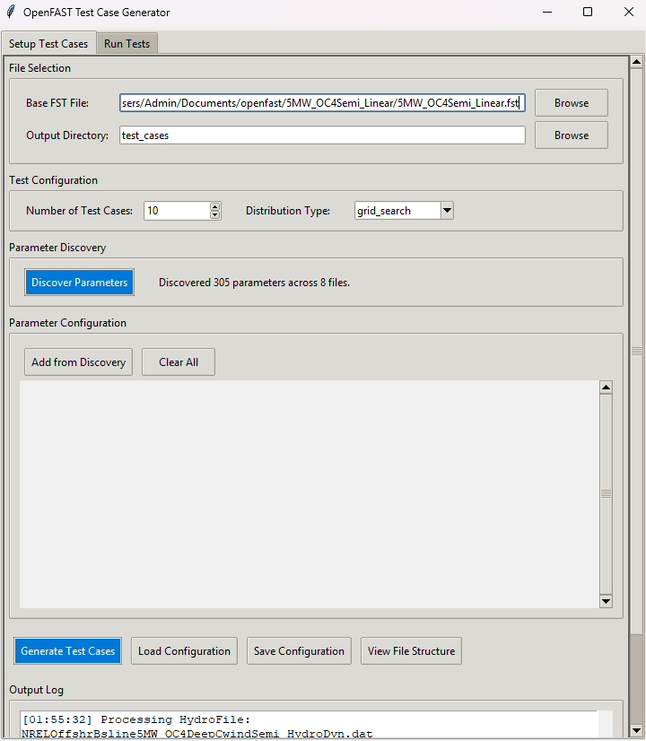
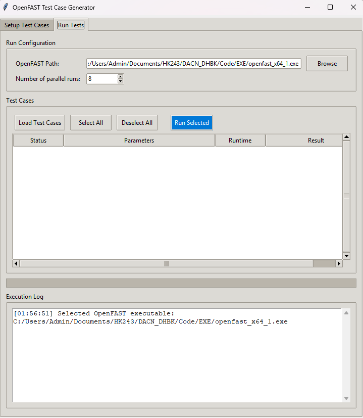

# OpenFAST Python Toolkit

[![Python Version][python-badge]][python-link]
[![License: MIT][license-badge]][license-link]
[![Pull Requests Welcome][pr-badge]][pr-link]

A suite of user-friendly Python tools designed to streamline and enhance the OpenFAST workflow. This toolkit provides utilities for 3D visualization, automated test case generation, and output data conversion.


*Example 3D visualization of the NREL 5MW turbine on the OC4-DeepCwind semi-submersible platform.*

---

## Table of Contents

- [Features](#features)
- [Repository Structure](#repository-structure)
- [Installation](#installation)
- [Usage](#usage)
  - [1. 3D Model Visualizer (`visualizer.py`)](#1-3d-model-visualizer-visualizerpy)
  - [2. Test Case Generator GUI (`test_case_gui.py`)](#2-test-case-generator-gui-test_case_guipy)
  - [3. Output File Converter (`converter.py`)](#3-output-file-converter-converterpy)
- [Contributing](#contributing)
- [License](#license)

---

## Features

✅ **3D Model Visualizer (`visualizer.py`)**
-   Parses the main `.fst` file and automatically follows links to other input files (ElastoDyn, MoorDyn, etc.).
-   Generates an interactive 3D plot of the wind turbine, tower, platform, and mooring system.
-   Displays key geometric parameters and environmental conditions directly on the plot.
-   Saves a summary of the model configuration to `.json` and `.txt` files.

✅ **Test Case Generator GUI (`test_case_gui.py`)**
-   A user-friendly graphical interface for creating and managing large simulation campaigns.
-   **Parameter Discovery:** Automatically scans all input files to find and catalog available numerical parameters.
-   **Multiple Generation Strategies:**
    -   **Grid Search:** Generates all possible combinations of parameter variations.
    -   **CSV Column-wise:** Creates test cases directly from columns in a CSV file.
    -   **Sampling:** Generates cases using Latin Hypercube, Uniform, or Normal distributions (requires `scipy`).
-   **Parallel Execution:** Runs selected test cases in parallel to significantly speed up simulations, with real-time progress and logging.
-   **Configuration Management:** Save and load your test case generation setup to a `.json` file for reproducibility.

✅ **Output File Converter (`converter.py`)**
-   Converts standard OpenFAST text output files (`.out`) into the widely-used `.csv` format.
-   Robustly handles different numerical formats, including scientific notation.
-   Automatically generates:
    -   A clean `.csv` file with all data channels.
    -   A `_metadata.txt` file with column names and units.
    -   A `_stats.csv` file with descriptive statistics (mean, std, etc.).
    -   A `_plots.png` image with example plots of key channels like platform motion and power generation.

---
---

## Installation

### Prerequisites
-   Python 3.7+
-   A working installation of OpenFAST (required for running simulations with the GUI).
-   The OpenFAST r-test repository is a great source for example models.

### Setup Steps

1.  **Clone the repository:**
    ```bash
    git clone https://github.com/YOUR_USERNAME/openfast-python-toolkit.git
    cd openfast-python-toolkit
    ```

2.  **Create a virtual environment (recommended):**
    ```bash
    python -m venv venv
    source venv/bin/activate  # On Windows, use `venv\Scripts\activate`
    ```

3.  **Install the required Python packages:**
    The project dependencies are listed in `requirements.txt`.
    ```bash
    pip install -r requirements.txt
    ```
    The `requirements.txt` file should contain:
    ```
    numpy
    matplotlib
    pandas
    scipy
    ```

---

## Usage

### 1. 3D Model Visualizer (`visualizer.py`)

This script helps you verify your OpenFAST model's geometry and layout before running simulations.

**To Run:**
1.  Place the `visualizer.py` script in the same directory as your main `.fst` file and its associated data files (e.g., the `5MW_OC4Semi_WSt_WavesWN` directory from the r-test).
2.  Modify the `main_fst_file` variable at the bottom of the script to match your file name.
    ```python
    if __name__ == "__main__":
        # --- MODIFY THIS LINE ---
        main_fst_file = '5MW_OC4Semi_WSt_WavesWN.fst'
        # ----------------------
        
        # ... rest of the script
    ```
3.  Run the script from your terminal:
    ```bash
    python visualizer.py
    ```

An interactive Matplotlib window will appear with the 3D visualization. The script will also generate `openfast_model_summary.json` and `openfast_model_summary.txt` files in the same directory.

### 2. Test Case Generator GUI (`test_case_gui.py`)

This powerful GUI automates the creation and execution of parametric studies.




*The Setup and Run tabs of the Test Case Generator GUI.*

**To Run:**
Simply execute the script from your terminal. No modifications are needed.
python test_case_gui.py
**Workflow:**
1.  **Launch the GUI.**
2.  **Setup Tab -> File Selection:**
    -   Click "Browse" to select your base `.fst` file.
    -   Choose an output directory for the generated cases.
3.  **Setup Tab -> Parameter Discovery:**
    -   Click **"Discover Parameters"**. The tool will scan all linked files and report the number of parameters found.
4.  **Setup Tab -> Parameter Configuration:**
    -   Click **"Add from Discovery"** to open a searchable list of all found parameters. Select the ones you want to vary and click "Add Selected".
    -   Configure the range, steps, or list of values for each parameter based on the chosen "Distribution Type".
5.  **Setup Tab -> Action:**
    -   Click **"Generate Test Cases"**. The tool will create a sub-directory for each case in your specified output directory.
6.  **Run Tests Tab:**
    -   The GUI will prompt you to switch to the "Run Tests" tab.
    -   Click **"Load Test Cases"** and select the directory you just generated.
    -   Browse for your OpenFAST executable (e.g., `openfast_x64.exe`).
    -   Select the cases you want to run from the list.
    -   Click **"Run Selected"** to start the simulations in parallel. Watch the log and progress bar for real-time updates.
