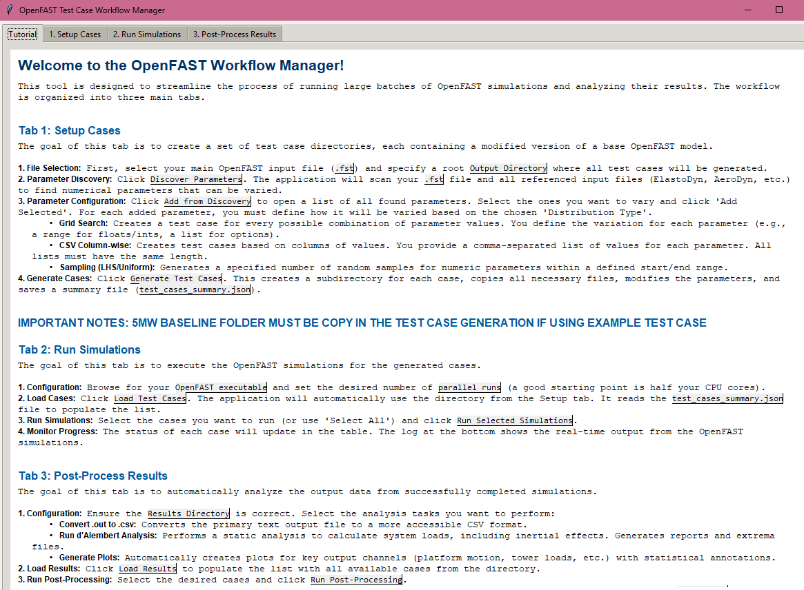

# OpenFAST Python Toolkit

[![Python Version][python-badge]][python-link]
[![License: MIT][license-badge]][license-link]
[![Pull Requests Welcome][pr-badge]][pr-link]

A user-friendly, all-in-one graphical application designed to manage the entire OpenFAST simulation workflow, from parametric case generation and parallel execution to advanced post-processing and data analysis.


*The unified interface of the OpenFAST Workflow Manager, showing the Setup, Run, and Post-Process tabs.*

---

## Table of Contents

- [Changelog](#changelog)
- [Features](#features)
- [Installation](#installation)
- [Usage](#usage)
  - [Workflow Overview](#workflow-overview)
  - [Tab 0: Tutorial](#tab-0-tutorial)
  - [Tab 1: Setup Cases](#tab-1-setup-cases)
  - [Tab 2: Run Simulations](#tab-2-run-simulations)
  - [Tab 3: Post-Process Results](#tab-3-post-process-results)
- [Configuring OpenFAST Output Channels](#configuring-openfast-output-channels)
- [Advanced Features](#advanced-features)
- [Contributing](#contributing)
- [License](#license)
- [Acknowledgments](#acknowledgments)

---

## Changelog

### **v0.3 - The Enhanced Analysis Update**

This version introduces significant improvements to the user interface, analysis capabilities, and robustness.

#### **🎓 NEW - Interactive Tutorial Tab**
-   **In-App Guidance:** A comprehensive tutorial tab is now the first thing users see, providing step-by-step instructions for the entire workflow.
-   **Rich Formatting:** Uses text tags for headers, code examples, warnings, and success messages for easy reading.
-   **Complete Reference:** Includes detailed instructions for configuring OpenFAST output channels for accurate d'Alembert analysis.

#### **🔧 Enhanced d'Alembert Analysis**
-   **High-Fidelity Mooring Forces:** Now supports direct MoorDyn connection point force outputs (`Con{4,5,6}Fx/Fy/Fz`) for zero-error force calculations.
-   **Intelligent Fallback:** Automatically detects available data and falls back to geometric approximation when high-fidelity data is unavailable.
-   **Comprehensive Validation:** Real-time comparison between computed forces and reported tension magnitudes with error reporting.
-   **Enhanced Reporting:** Staticized reports now include:
    - Detailed simulation parameters (TMax, DT, module configuration)
    - Complete system geometry (tower, nacelle, rotor dimensions)
    - Mooring system configuration with fairlead and anchor positions
    - Statistical analysis of mooring forces (mean, min, max, std dev, occurrence times)
    - Force calculation method documentation for each mooring line
    - Analysis notes explaining reference frames and methods

#### **⚙️ Dynamic Analysis Time Configuration**
-   **Automatic TMax Detection:** The analysis start time is now automatically set to TMax/3 from the FST file.
-   **Improved Accuracy:** Ensures statistical analysis focuses on steady-state behavior regardless of simulation duration.
-   **Logging:** Clear messages in the log show the detected TMax and calculated analysis start time.

#### **🎨 User Interface Improvements**
-   **Fixed Scrolling Issues:** Resolved blank space problems in the Setup tab with proper canvas width binding.
-   **Improved Parameter Configuration:** Fixed height container with proper scroll propagation for the parameter list.
-   **Better Visibility:** All sections now properly fill horizontal space and maintain readability.

#### **🐛 Bug Fixes**
-   **CSV Column-wise Input:** Fixed integer parameter handling to accept decimal values (e.g., `1.0, 2.0, 3.0`).
-   **Plotting Thread Safety:** Added dedicated lock for matplotlib operations to prevent multithreading conflicts.
-   **Path Rewriting:** Enhanced file path rewriting to handle `../` prefixes and complex directory structures.

#### **📊 Enhanced Plotting**
-   **Improved Channel Detection:** Better handling of FairTen channels as scalar outputs.
-   **Fixed Group Plots:** Correctly identifies and plots fairlead tension groups.
-   **Robust Column Matching:** Case-insensitive column name matching for greater compatibility.

---

## Features

The toolkit is a single, integrated application handling the end-to-end simulation process.

✅ **Tab 0: Tutorial**
-   **Interactive Guide:** Step-by-step instructions for the entire workflow
-   **Configuration Reference:** Detailed guidance on setting up OpenFAST output channels
-   **Best Practices:** Recommendations for high-fidelity analysis
-   **Rich Formatting:** Clear visual hierarchy with code examples and warnings

✅ **Tab 1: Setup Cases**
-   **Deep Parameter Discovery:** Automatically scans `.fst` files and all linked inputs to catalog available parameters
-   **Multiple Generation Strategies:**
    -   **Grid Search:** All possible combinations of parameter variations
    -   **CSV Column-wise:** Cases based on comma-separated value rows
    -   **Sampling:** Latin Hypercube, Uniform, or Normal distributions (requires `scipy`)
-   **Geometric Variations (Optional):** Automatic scaling of platform geometry
    -   **Grid Mode:** All combinations of height × diameter scales
    -   **Matched Mode:** Height and diameter scale together
-   **Configuration Management:** Save/load entire parametric study setups to `.json` files

✅ **Tab 2: Run Simulations**
-   **Parallel Execution:** Configurable number of concurrent OpenFAST instances
-   **Real-time Monitoring:** Track status, runtime, and results for each simulation
-   **Error Detection:** Automatic detection of runtime errors in OpenFAST output
-   **Detailed Logging:** Live output from each OpenFAST instance

✅ **Tab 3: Post-Process Results**
-   **Automated Analysis Pipeline:** Process multiple cases in parallel
-   **Robust CSV Conversion:** Handles duplicate columns and various `.out` file formats
-   **Publication-Ready Plots:** Automatic generation with statistical annotations
-   **Advanced d'Alembert Analysis:**
    -   Quasi-static load extraction with inertial effects
    -   Automatic mass/inertia calculations from model geometry
    -   High-fidelity mooring force analysis
    -   Comprehensive reports with extrema analysis
    -   Validation metrics and error reporting

---

## Installation

### Prerequisites
-   **Python 3.7+**
-   **OpenFAST:** A working installation is required to run simulations
-   **Example Models:** The [OpenFAST r-test repository](https://github.com/OpenFAST/r-test) provides excellent example models

### Setup Steps

1.  **Clone the repository:**
    ```bash
    git clone https://github.com/TomatoXoX/OpenFAST_GUI_Toolbox.git
    cd OpenFAST_GUI_Toolbox
    ```

2.  **Create a virtual environment (recommended):**
    ```bash
    python -m venv venv
    source venv/bin/activate  # On Windows: venv\Scripts\activate
    ```

3.  **Install required packages:**
    ```bash
    pip install numpy matplotlib pandas scipy
    ```

---

## Usage

### Workflow Overview

The toolkit provides a unified application with four tabs:

1.  **Tutorial:** Learn how to use the application
2.  **Setup Cases:** Define and generate test cases
3.  **Run Simulations:** Execute OpenFAST in parallel
4.  **Post-Process Results:** Analyze and visualize data

### Launching the Application

```bash
python GUI_Test_3.py
```

### Tab 0: Tutorial

The tutorial tab provides:
-   **Workflow Guide:** Complete walkthrough of all three main tabs
-   **Output Configuration:** Detailed instructions for setting up OpenFAST output channels
-   **MoorDyn Setup:** Specific guidance on high-fidelity mooring force configuration
-   **Verification Checklist:** Pre-run checklist to ensure proper configuration

### Tab 1: Setup Cases

**Step 1: File Selection**
-   Select your main `.fst` file
-   Specify output directory for test cases

**Step 2: Parameter Discovery**
-   Click "Discover Parameters"
-   Application scans all referenced files
-   Parameters are categorized by file and type

**Step 3: Configure Variations**
-   Choose distribution type (Grid Search, CSV, or Sampling)
-   Add parameters from discovery
-   Define variation ranges/values
-   (Optional) Enable geometric variations

**Step 4: Generate Cases**
-   Review total case count
-   Click "Generate Test Cases"
-   Application creates directories, copies files, and modifies parameters

### Tab 2: Run Simulations

**Step 1: Configuration**
-   Browse for OpenFAST executable
-   Set number of parallel workers

**Step 2: Load Cases**
-   Click "Load Test Cases"
-   Automatically reads from Setup directory

**Step 3: Execute**
-   Select cases to run
-   Click "Run Selected Simulations"
-   Monitor progress in real-time

### Tab 3: Post-Process Results

**Step 1: Select Tasks**
-   ☑ Convert `.out` to `.csv`
-   ☑ Run d'Alembert Analysis
-   ☑ Generate Plots

**Step 2: Load Results**
-   Click "Load Results"
-   Cases populate from results directory

**Step 3: Process**
-   Select cases for analysis
-   Click "Run Post-Processing"
-   View results by right-clicking → "Open Folder"

---

## Configuring OpenFAST Output Channels

For accurate d'Alembert analysis, specific output channels must be configured.

### Required Outputs by Module

#### **1. Main FST File**
Ensure these modules are enabled:
```
CompElast = 1    # ElastoDyn - required
CompHydro = 1    # HydroDyn - required for offshore
CompMooring = 3  # MoorDyn - required for moored platforms
```

#### **2. ElastoDyn Outputs**
Add to `OutList` section:
```
"TwrBsFxt", "TwrBsFyt", "TwrBsFzt"  # Tower base forces
"TwrBsMxt", "TwrBsMyt", "TwrBsMzt"  # Tower base moments
"PtfmRoll", "PtfmPitch", "PtfmYaw"  # Platform orientation
"PtfmSurge", "PtfmSway", "PtfmHeave" # Platform displacement
```

#### **3. HydroDyn Outputs**
Add to `OutList` section:
```
"HydroFxi", "HydroFyi", "HydroFzi"  # Hydrodynamic forces
"HydroMxi", "HydroMyi", "HydroMzi"  # Hydrodynamic moments
```

#### **4. MoorDyn Outputs (CRITICAL)**
For **HIGH-FIDELITY** analysis (0% error), add to `OUTPUTS` section:

```
------------------------ OUTPUTS --------------------------------------------
FairTen1    # Fairlead 1 tension (for validation)
FairTen2    # Fairlead 2 tension
FairTen3    # Fairlead 3 tension
Con4Fx      # Fairlead 1 force X-component (HIGH FIDELITY)
Con4Fy      # Fairlead 1 force Y-component
Con4Fz      # Fairlead 1 force Z-component
Con5Fx      # Fairlead 2 force X-component (HIGH FIDELITY)
Con5Fy      # Fairlead 2 force Y-component
Con5Fz      # Fairlead 2 force Z-component
Con6Fx      # Fairlead 3 force X-component (HIGH FIDELITY)
Con6Fy      # Fairlead 3 force Y-component
Con6Fz      # Fairlead 3 force Z-component
END
-----------------------------------------------------------------------------
```

**Point Numbering for OC4:**
-   Points 1-3: Anchors (seabed)
-   Points 4-6: Fairleads (platform)
-   Use `Con4/5/6` for fairlead forces

⚠️ **Important:** Do NOT use `Line{k}Fx/Fy/Fz` - these may report anchor forces!

### Verification Checklist

Before running:
-   ✓ All ElastoDyn outputs configured
-   ✓ All HydroDyn outputs configured  
-   ✓ MoorDyn connection forces configured
-   ✓ FairTen outputs included for validation
-   ✓ TMax sufficient for steady-state
-   ✓ Time step (DT) appropriate

---

## Advanced Features

### Geometric Variations
-   Automatic platform geometry scaling
-   Preserves structural ratios and proportions
-   Requires `advanced_geometry_engine.py`

### d'Alembert Analysis Details
-   **Automatic Mass Properties:** Calculated from tower, blades, nacelle, hub, and platform
-   **Inertial Effects:** Includes translational and rotational inertia
-   **Load Extrema:** Identifies critical load cases (min, max, mean)
-   **Validation:** Real-time force magnitude comparison
-   **Comprehensive Reports:** Includes geometry, configuration, and statistics

### Expected Analysis Results
When properly configured:
-   **0.00% validation error** for high-fidelity mooring forces
-   **Realistic magnitudes** (7-12 MN for OC4 semi-submersible)
-   **Detailed statistics** (mean, std dev, min/max, occurrence times)
-   **Method documentation** for each force calculation

---

## Contributing

Contributions are welcome! Please:
1.  Fork the repository
2.  Create a feature branch
3.  Submit a pull request with a clear description

---

## License

This project is licensed under the MIT License. See `LICENSE` file for details.

---

## Acknowledgments

**Author:** Trang Vinh Nghi

**Development Supported By:**  
Department of Aerospace Engineering  
Ho Chi Minh City University of Technology  
Vietnam National University

**Contact:**  
📧 Email: trangvinhnghi2212@gmail.com  
🐙 GitHub: https://github.com/TomatoXoX/OpenFAST_GUI_Toolbox

---

**Thank you for using the OpenFAST Workflow Manager!** We hope this tool enhances your simulation workflow and analysis efficiency.

[python-badge]: https://img.shields.io/badge/python-3.7+-blue.svg
[python-link]: https://www.python.org/downloads/
[license-badge]: https://img.shields.io/badge/License-MIT-yellow.svg
[license-link]: https://opensource.org/licenses/MIT
[pr-badge]: https://img.shields.io/badge/PRs-welcome-brightgreen.svg
[pr-link]: https://github.com/TomatoXoX/OpenFAST_GUI_Toolbox/pulls
